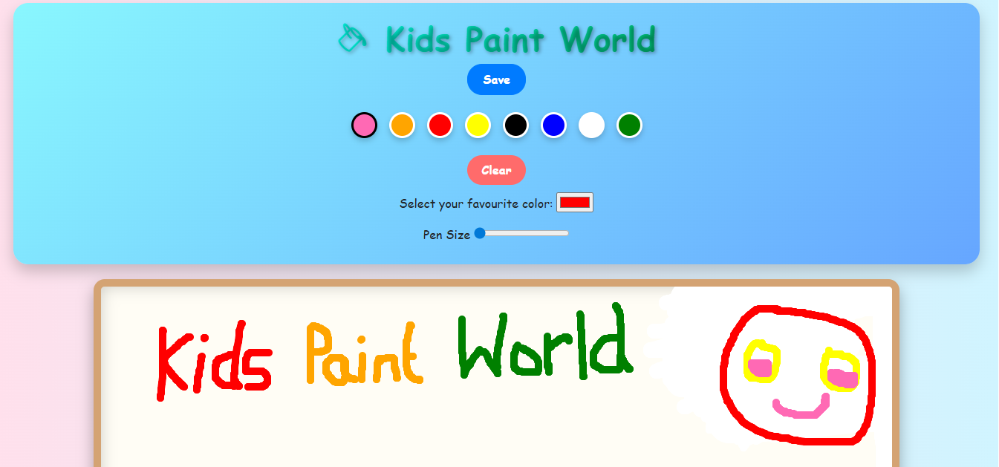

# 🎨 Kids Paint World

A fun and interactive drawing web application designed for kids 🎨🧸  
Create beautiful drawings with colorful tools, smooth brushes, and an easy-to-use interface.

---

## ✨ Features

- 🎨 Multiple color palette (rainbow colors)
- 🖌️ Adjustable brush size
- 🧽 Clear canvas option
- 🎯 Smooth drawing experience
- 🌈 Color picker (custom colors)
- 💾 Save drawing as image
- 🧸 Kid-friendly UI with animations

---

## 📸 Screenshots



---

## 🛠️ Tech Stack

- HTML5
- CSS3
- JavaScript
- Canvas API

---

## 🚀 How to Run

1. Clone the repository
```bash
git clone https://github.com/your-username/kids-paint-world.git
